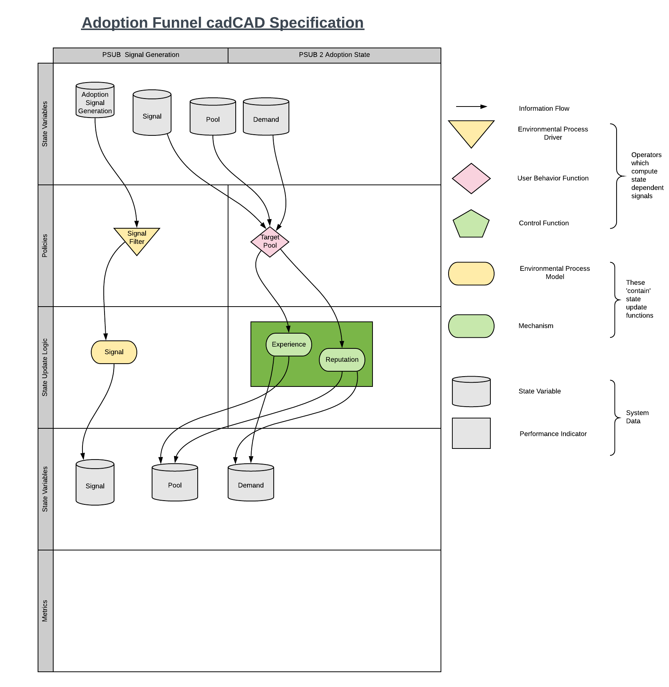

# Adoption Funnel

Building a Markov mixing process to exhibit the dynamics of an adoption process as a finite state machine.
## State Machine

Develop a module to be utilized within other cadCAD models as a consequence of a driving signal.
## cadCAD Specification
